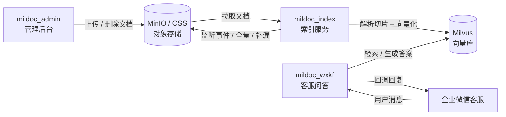
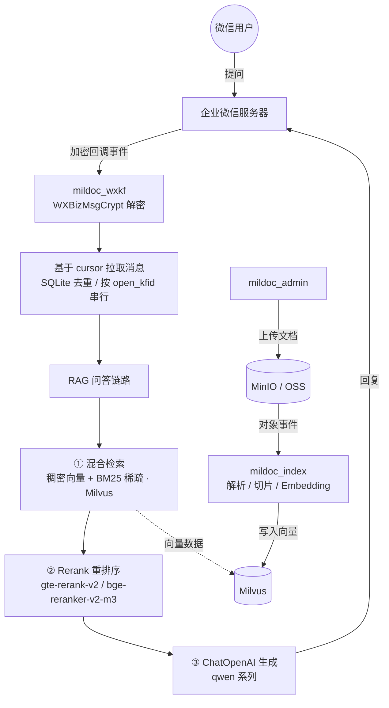

# Mildoc 智能客服系统

基于 **企业微信客服 + RAG（检索增强生成）** 的智能问答系统。管理员将文档入库后，终端用户在微信客服中提问，系统自动从知识库检索相关内容并由大模型生成专业、准确的客服回答，支持"转人工"无缝交接。

---

## 一、项目功能

- **知识库自动构建**：将 PDF / Word / Excel / PPT / Markdown / TXT 等文档解析、切片、向量化后写入向量数据库。
- **智能客服问答**：对接企业微信客服，自动回复用户咨询，回答严格基于知识库内容，不编造。
- **混合检索（RAG）**：稠密向量（语义）+ BM25 稀疏向量（关键词）双路召回，经重排序（Rerank）后送大模型生成答案。
- **转人工**：用户说"转人工"时，自动将会话转入人工接待池。
- **管理后台**：内部用于浏览对象存储文件、查看文档索引分片、上传/下载/删除知识库文档。
- **实时增量索引**：监听对象存储事件，文档新增/删除时自动同步到向量库（也支持全量刷新与排查补漏）。

---

## 二、模块说明

项目由三个相对独立的服务模块组成：

| 模块 | 职责 | 使用方 |
| --- | --- | --- |
| `mildoc_index` | 文档解析与索引入库（MinIO/OSS → 解析 → Embedding → Milvus） | 运维/后台任务 |
| `mildoc_admin` | Web 管理后台（文件浏览、索引查看、上传/下载/删除） | 内部管理员 |
| `mildoc_wxkf` | 企业微信客服回调与 RAG 问答服务（面向终端用户） | 终端客户 |

### 1. `mildoc_index`（索引服务）
- 支持三种运行模式（见 `main.py`）：
  - `full-refresh`：全量刷新，遍历存储桶重新索引。
  - `backfill`：排查补漏，仅索引 Milvus 中缺失的文档。
  - `listen`：增量更新，实时监听 MinIO 事件（`ObjectCreated` / `ObjectRemoved`）自动同步。
- 解析器支持：PDF、Office（doc/docx/xls/xlsx/ppt/pptx）、Markdown、纯文本；切片默认 `chunk_size=512, overlap=128`。
- 向量化使用 `text-embedding-v4`（维度 768）。
- 同时支持 MinIO 与阿里云 OSS 两种对象存储。

### 2. `mildoc_admin`（管理后台，Flask）
- 账号密码登录（`ADMIN_USERNAME` / `ADMIN_PASSWORD`）。
- 浏览 MinIO 文件树、查看某文档在 Milvus 中的索引分片内容。
- 上传（≤500MB）、下载、删除文件；删除文件时同步清理 Milvus 中的索引记录。
- 注：该模块为内部管理员使用，对高并发不敏感。

### 3. `mildoc_wxkf`（客服问答服务，Flask，面向用户）
- 企业微信回调加解密（`WXBizMsgCrypt`，AES）。
- 收到 `kf_msg_or_event` 事件后，通过 `kf/sync_msg` 接口基于 **cursor 游标**拉取消息，保证幂等、不丢不重。
- 客户文本消息走 RAG 生成回答；多媒体消息（图片/语音/视频/文件/位置/链接等）给预设的礼貌性罐头回复。
- 支持进入会话欢迎语、会话状态变更、转人工等系统事件。
- 健康检查接口 `/health`。

### 模块关系图



---

## 三、技术架构

```
                  企业微信用户
                      │ 提问/消息
                      ▼
            企业微信服务器 (回调推送)
                      │ 加密事件
                      ▼
   ┌─────────────────────────────────────────────┐
   │            mildoc_wxkf (Flask)                │
   │  WXBizMsgCrypt 解密 → 按 open_kfid 串行处理   │
   │  cursor 拉取(kf/sync_msg) → SQLite 去重       │
   │       │                                     │
   │       ▼  RAG 问答链路                         │
   │  ┌──────────────────────────────────────┐    │
   │  │ 1. 混合检索 (Milvus 稠密+BM25稀疏)    │    │
   │  │ 2. Rerank 重排序 (gte-rerank-v2 等)   │    │
   │  │ 3. ChatOpenAI (qwen 系列) 生成答案    │    │
   │  └──────────────────────────────────────┘    │
   │       │ 回复                                  │
   │       ▼ kf/send_msg                           │
   └─────────────────────────────────────────────┘
                      │
        知识库构建链路 (另一条独立链路)
                      │
   MinIO/OSS ──► mildoc_index ──► 解析切片 ──► Embedding ──► Milvus
                      ▲                               │
                      └────── mildoc_admin 上传文档 ───┘

依赖中间件：Milvus（向量库）、MinIO/OSS（对象存储）、SQLite（消息去重/cursor）
大模型服务：DashScope 兼容 OpenAI 协议（LLM + Embedding + Rerank）
```

**核心技术栈**
- 向量检索：`Milvus`（服务端内置 BM25 Function，jieba 中文分词，稠密 + 稀疏双路）
- 召回融合：`weighted` 加权融合（稠密 0.7 / BM25 0.3）
- 重排序：百炼 `gte-rerank-v2` 或 硅基流动 `BAAI/bge-reranker-v2-m3`
- 大模型：`qwen` 系列（通过 `langchain_openai.ChatOpenAI` 调用）
- 框架：`Flask`、`LangChain`（community / openai / milvus / text-splitters）
- 微信：`WXBizMsgCrypt` 消息加解密、`requests` 调用企业微信 API

### 架构全景图



---

## 四、操作流程

### 1. 知识库构建（后台）
1. 管理员通过 `mildoc_admin` 上传文档到 MinIO（或直接写入 MinIO 桶）。
2. `mildoc_index` 监听 MinIO 事件（或手动执行 `full-refresh` / `backfill`）：
   - 解析文档 → 切片 → 调用 Embedding → 写入 Milvus（dense 向量 + BM25 稀疏向量自动生成）。
3. 文档删除时同步清理 Milvus 索引记录。

### 2. 用户问答（面向终端）
1. 用户在企业微信客服发起会话 / 发送文本消息。
2. 企业微信将加密事件推送到 `mildoc_wxkf` 的 `/callback/command`。
3. 服务解密 → 提交线程池 → 按 `open_kfid` 加锁串行处理（避免 cursor 竞态）。
4. 基于 cursor 拉取消息 → 内存 + SQLite 双重去重 → 仅处理 10 分钟内的客户消息。
5. RAG 链路：混合检索 → Rerank → 大模型生成 → 通过 `kf/send_msg` 回复用户。
6. 命中"转人工"关键词 → 将会话转入人工接待池。

### 3. 部署提示
- 各模块均为独立 Flask 服务，各自读取 `.env` 配置，可分开部署。
- `mildoc_index` 的 `listen` 模式建议用 `nohup` 后台常驻。
- 微信客服后台需将回调 URL 配置到 `mildoc_wxkf` 的外网地址（需支持 AES 校验）。

---

## 五、项目亮点

1. **混合检索 + 重排序**：稠密向量（语义）与 BM25 稀疏（关键词）双路召回，再经 Rerank 精排，对中文客服场景召回质量较好。
2. **服务端 BM25**：利用 Milvus 内置 `BM25BuiltInFunction`，查询时服务端自动转稀疏向量，无需本地维护分词/词典。
3. **实时增量索引**：MinIO 事件监听实现"文档一入库即生效"，并保留全量/补漏两种兜底模式。
4. **消息幂等处理**：cursor 游标分页 + 内存缓存 + SQLite `processed_messages` 表三重去重；按 `open_kfid` 加锁避免并发拉取导致重复消费。
5. **微信客服完整性**：消息加解密、进入会话欢迎语、会话状态变更、转人工交接等事件均覆盖。
6. **配置化 / 多厂商可切换**：对象存储（MinIO/OSS）、Rerank 厂商（百炼/硅基）、模型名称均通过环境变量配置，便于替换。
7. **健壮的工程细节**：线程池与接收/处理解耦、并发嵌套线程池隔离、超时与错误兜底、日志完善、预留 Langfuse 可观测性。

---

## 六、项目瓶颈（重点：mildoc_wxkf）

> `mildoc_admin` 与 `mildoc_index` 为内部管理员/后台使用，流量低、对并发不敏感，瓶颈主要集中在面向终端用户的 **`mildoc_wxkf`** 客服服务。

1. **无多轮对话上下文（最大瓶颈）**
   `query_service` 每次仅使用当前这一句 `query` 检索与生成，没有历史会话记忆。用户说"它多少钱""这个怎么退"等指代性问题时，模型无法理解上下文，回答会出现歧义或答非所问。

2. **同步阻塞式回复，易超时**
   RAG 全链路（混合检索 + Rerank + LLM 生成）在回调线程内同步执行。大模型调用耗时较长，可能超出企业微信客服的响应时限；且同一 `open_kfid` 被锁串行处理，高峰期会排队。

3. **无答案缓存**
   相同或高度相似的问题每次都走完整检索 + Rerank + LLM，重复计算、成本高、延迟大。

4. **长回复被截断**
   `KF_MAX_REPLY_LENGTH=2048`，超出直接截断并追加"内容过长已截断"，未做自动分段连续发送，影响阅读体验。

5. **多媒体消息能力不足**
   图片/语音/视频/文件等仅返回固定罐头文案，未接入 OCR、语音识别（ASR）、图片理解（VLM），丢失了关键信息入口。

6. **兜底过于泛化，无降级**
   检索为空或失败统一返回"抱歉，我暂时无法理解您的问题"。没有"检索为空时让通用大模型兜底回答"或"主动建议转人工"的降级策略。

7. **单实例 + SQLite 限制**
   去重与 cursor 持久化依赖进程内锁 + 本地 SQLite。多实例横向扩容时，进程内锁失效，需改分布式锁（代码中已注释提示）；SQLite 也可能成为写入瓶颈。

8. **场景/意图识别被关闭**
   `scene_info` 目前恒为 `None`，未做意图分流（如售后/投诉/技术咨询路由到不同话术或人工队列）。

9. **单点模型依赖与时效限制**
   仅处理 10 分钟内消息，长会话易中断；且 LLM/Rerank/Embedding 强依赖单一厂商（DashScope），缺乏熔断与备用通道。

---

## 七、解决思路

- **多轮记忆**：引入 Redis/会话表保存对话历史，`query_service` 增加 `history` 参数，Prompt 中拼接最近 N 轮；检索时也可基于历史做 query 改写（Query Rewriting）。
- **异步化回复**：收到消息先回"正在为您查询…"，RAG 在后台线程/消息队列执行，完成后再用 `kf/send_msg` 主动推送，规避超时。
- **答案缓存**：对 query 的 Embedding 做近邻去重，相似问题直接复用答案；或缓存高频 FAQ。
- **长文分段**：超过长度阈值时按语义/标点切分，分多条消息发送。
- **多媒体理解**：图片走 OCR/VLM、语音走 ASR 转文本后再进入 RAG。
- **智能降级**：检索为空时，由通用大模型做"知识库外"的礼貌性兜底，或按置信度低主动建议转人工。
- **多实例支持**：用 Redis 替代 SQLite 存储 cursor 与去重，引入分布式锁（如 Redis 锁）支持水平扩容。
- **意图路由**：恢复场景检测，按意图分流话术/人工队列，并对投诉、售后等高风险场景优先转人工。
- **多厂商熔断**：为 LLM/Rerank/Embedding 配置备用通道，异常时自动切换。

---

## 八、扩展点与可优化项

**功能扩展**
- 多知识库 / 多租户隔离（按客服账号或业务线路由不同 collection）。
- 人工坐席工作台：将"转人工"后的会话接入坐席系统，支持人机协同。
- 数据看板与评估：利用已预留的 Langfuse 做调用链追踪、Token 成本与回答质量监控。
- 知识库运营：文档版本管理、失效文档自动下线、索引质量评估（Hit Rate / MRR）。
- 主动提问/澄清：当检索置信度低时，反问用户以缩小范围。

**工程优化**
- 流式回复（SSE / 分段推送）提升体感速度。
- 召回评估与调参：调整 `nprobe`、融合权重、`top_n`、切片大小以获得更优召回。
- 批量 Embedding：当前逐片段调用，可改用 `get_embeddings_batch` 提升入库吞吐。
- 配置校验增强：`Config.validate_config` 可覆盖更多必填项与格式校验。
- 安全增强：管理后台增加更细的权限/审计；客服服务增加限流与防刷。
- 文档解析增强：表格、图片型 PDF、扫描件 OCR 等复杂版式的解析能力。

---

## 九、目录结构（简）

```
mildoc_zbb/
├── mildoc_index/        # 文档解析与向量入库（full-refresh / backfill / listen）
├── mildoc_admin/        # Web 管理后台（文件/索引管理）
└── mildoc_wxkf/         # 企业微信客服回调 + RAG 问答
    ├── wxkf_callback_app.py   # 回调接收/解密/路由
    ├── kf_message_handler.py  # 消息拉取/去重/回复编排
    ├── rag_service.py         # RAG 核心（检索 + Rerank + 生成）
    ├── rerank_service.py      # 重排序服务（多厂商）
    ├── wecom_api.py           # 企业微信 API 封装
    └── cursor_manager.py      # cursor / 去重持久化（SQLite）
```
